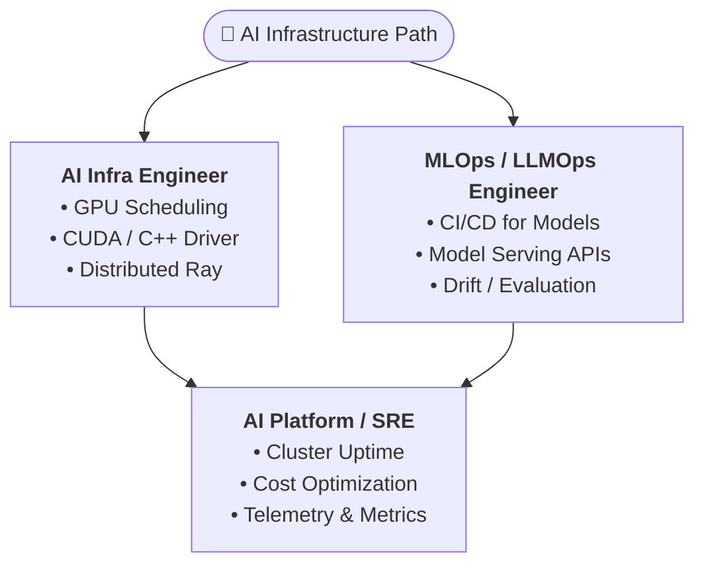

# AI Infrastructure & Operations

AI Infrastructure and AI Operations requires understanding two complementary engineering tracks:

- AI Infrastructure Engineering: Focuses on the low-level systems layer—GPU compute clusters, CUDA runtime, high-speed inter-node networking (InfiniBand/RoCE), distributed training frameworks, and bare-metal/cloud orchestration.
- AI Operations (MLOps / LLMOps): Focuses on the application and platform layer—model deployment pipelines, experiment tracking, feature/vector stores, API serving, monitoring, and cost optimization.

## The 5-Phase Learning Roadmap

Phases - the key Core Objective, Tools & Technologies, and Milestone Deliverable:

### 1. Cloud & Linux Fundamentals:	
- Master OS operations, containerization, and Infrastructure as Code (IaC).	
- Linux (Bash, systemd), Docker, Kubernetes, Terraform, AWS/GCP/Azure.	
- Containerize a web service and provision a Kubernetes cluster via Terraform.

### 2. Machine Learning Systems:	
- Understand how models consume compute, memory, and data.	
- Python, PyTorch, CUDA basics, MLflow, DVC.
- Build a PyTorch training pipeline with dataset versioning in DVC and experiment tracking in MLflow.

### 3. Distributed Orchestration:	
- Learn to manage multi-node compute and GPU job scheduling.	
- Ray / KubeRay, Slurm, NVIDIA GPU Operator, Kubernetes.
- Deploy a multi-node Ray cluster on cloud VMs to process a distributed workload.

### 4. High-Performance Serving:	
- Optimize inference for low latency, high throughput, and memory efficiency.	
- vLLM, TensorRT-LLM, NVIDIA Triton, TGI, Ollama.
- Host an open-source LLM using vLLM, applying quantization (AWQ/FP8) and dynamic batching.

### 5. Observability & AI Governance:	
- Monitor latency, token costs, model drift, and system health.	
- Prometheus, Grafana, OpenTelemetry, Langfuse, Guardrails	
- Create a Grafana dashboard tracking GPU vRAM utilization, Request Latency, and Token Cost/sec.

## Core Technical Skills Breakdown:

### 1. Hardware & Compute Optimization

- GPU Memory Mechanics: Understand VRAM allocation, KV-cache management, PagedAttention, and batch sizes.
- Quantization & Acceleration: Practice model compression techniques (INT8, INT4, FP8) using TensorRT or GGML to reduce compute overhead.
- Networking: Learn high-bandwidth interconnects (NVLink) and cluster networking primitives used in multi-GPU distributed training/inference.

### 2. Orchestration & Platform Engineering

- Kubernetes for AI: Learn specialized CRDs like KubeRay, Kubeflow, and the NVIDIA GPU Operator to expose hardware to containers.
- Infrastructure as Code: Automate node group creation (e.g., AWS EKS GPU node groups) using Terraform or Pulumi.
- Job Schedulers: Understand Slurm for high-performance computing (HPC) environments alongside Kubernetes for cloud-native setups.

### 3. MLOps & LLMOps Lifecycle

- Model Registries & Storage: Store model weights and artifacts reliably using S3/GCS paired with MLflow or Hugging Face Hub.
- Inference Serving: Benchmark latency differences between standard Python APIs (FastAPI) and engine-optimized servers (vLLM, Triton).
- RAG & Vector Operations: Manage operational aspects of vector databases (Qdrant, Milvus, Pinecone) for retrieval systems.

## Related Job Roles & Market Expectations

- AI Infrastructure Engineer: Focuses on compute scaling, GPU cluster health, distributed training (DeepSpeed, Megatron-LM), and C++/CUDA optimizations.
- MLOps / LLMOps Engineer: Focuses on end-to-end model delivery, CI/CD pipelines, API wrapper optimization, prompt evaluation pipelines, and vector DB maintenance.
- AI Platform / SRE Engineer: Focuses on cluster uptime, hardware failover handling (ECC error detection, dead node replacements), auto-scaling, and cloud spend control.

## Practical Strategy to Get Hired

1. Avoid Notebook-Only Projects: Employers care about production systems, not Jupyter notebooks. Put all your project code in structured repositories with Dockerfiles, CI/CD pipelines, and IaC scripts.

2. Rent Real Cloud GPUs: Use platforms like RunPod, Lambda Labs, or Modal to practice configuring actual GPU instances rather than running CPU simulations locally.

3. Focus on Cost vs. Latency: In interviews, highlight how you optimized cost per token, reduced Time-To-First-Token (TTFT), or reduced infrastructure spend using auto-scaling and spot instances.

## Recommended Courses by Phase

### Phase 1: Cloud & Linux Fundamentals

| Course | Platform | Key Topics |
|--------|----------|------------|
| [DevOps Engineer: AWS, Docker, Kubernetes, Terraform & CI/CD](https://www.udemy.com/course/devops-engineer-aws-docker-kubernetes-terraform-cicd/) | Udemy | Linux, Git, AWS, Docker, Kubernetes, Terraform, CI/CD, real-world projects |
| [Docker & Kubernetes: The Complete Practical Guide](https://www.udemy.com/course/docker-complete/) | Udemy | Docker images/containers, networks, volumes, Kubernetes Pods/Services/Ingress |
| [Kubernetes Hands-On - Deploy Microservices to AWS Cloud](https://www.udemy.com/course/kubernetes-microservices/) | Udemy | EKS/Kops, Prometheus/Grafana, ELK Stack, Helm, Horizontal Pod Autoscaling |
| [Complete AWS DevOps Course: CI/CD, Docker, Kubernetes](https://www.udemy.com/course/aws-devops-masterclass-cloud-cicd-docker-kubernetes/) | Udemy | AWS Core Services, Terraform, CloudFormation, Jenkins, GitHub Actions, CodePipeline |

### Phase 2: Machine Learning Systems (MLflow, DVC, PyTorch)

| Course | Platform | Key Topics |
|--------|----------|------------|
| [Complete MLOps Bootcamp With 10+ End-to-End ML Projects](https://www.udemy.com/course/complete-mlops-bootcamp-with-10-end-to-end-ml-projects/) | Udemy | MLflow, DVC, DagsHub, Airflow, CI/CD, AWS SageMaker, HuggingFace, Grafana |
| [MLOps: Real-World Machine Learning Projects for Professionals](https://www.udemy.com/course/mlops-real-world-machine-learning-projects-for-professional/) | Udemy | MLflow, DVC, Docker, Flask, GitHub Actions, AWS EC2, Chrome Extension integration |
| [End-to-End Machine Learning: From Idea to Implementation](https://www.udemy.com/course/sustainable-and-scalable-machine-learning-project-development/) | Udemy | DVC, MLflow, distributed training, feature extraction, model evaluation, MLOps principles |
| [Machine Learning Engineering for Production (MLOps) Specialization](https://www.coursera.org/specializations/machine-learning-engineering-for-production-mlops) | Coursera | 4-course specialization by Andrew Ng covering ML pipelines, model deployment, monitoring |

### Phase 3: Distributed Orchestration (Ray, KubeRay, Slurm)

| Resource | Platform | Key Topics |
|----------|----------|------------|
| [Raylings](https://github.com/dnf0/raylings) (Interactive exercises - **FREE**) | GitHub | Ray Core, Actors, Ray Train (PyTorch DDP), KubeRay on Kubernetes, vLLM, DeepSpeed/FSDP |
| [KubeRay Documentation & Examples](https://github.com/ray-project/kuberay) | Official Docs | RayCluster, RayJob, RayService CRDs, Gang scheduling, GKE/EKS integration |
| [Distributed Training with PyTorch and Ray Train](https://docs.pytorch.org/tutorials/beginner/distributed_training_with_ray_tutorial.html) | PyTorch Tutorials | TorchTrainer, ScalingConfig, multi-node, fault tolerance, checkpointing |
| [Anyscale Ray Summit 2024 Talks](https://www.youtube.com/watch?v=bbKpBTGf_AU) | YouTube | KubeRay + Kubernetes, 10K node scaling, Spotify/DoorDash case studies |

> **Note:** Dedicated Udemy courses for Ray/KubeRay are limited. The **Raylings** interactive exercises + official documentation are currently the best hands-on resources.

### Phase 4: High-Performance Serving (vLLM, TensorRT-LLM, Triton)

| Course | Platform | Key Topics |
|--------|----------|------------|
| [LLMOps And AIOps Bootcamp With 8 End-to-End Projects](https://www.udemy.com/course/llmops-and-aiops-bootcamp-with-9-end-to-end-projects/) | Udemy | Jenkins CI/CD, Docker, K8s, AWS/GCP, Prometheus, Vector DBs, vLLM, TensorRT-LLM |
| [Deploying LLMs: A Practical Guide to LLMOps in Production](https://www.udemy.com/course/deploy-ai-smarter-llm-scalability-ml-ops-cost-efficiency/) | Udemy | vLLM, TensorRT-LLM, Flash Attention, PagedAttention, GPTQ, AWQ, LoRA, DeepSpeed, MLflow |
| [LLMOps Engineer Program](https://sukruyusufkaya.com/en/programs/llmops-engineer-program) | Private/Şükrü Yusuf Kaya | vLLM/TGI/TensorRT-LLM serving, LangSmith/Phoenix observability, Kubernetes GPU Operator, KAITO |
| [Platform Engineering for AI Applications](https://www.letsboot.ch/en-gb/course/ai-platform-engineering) | letsboot.ch | vLLM, TensorRT-LLM, Triton, LiteLLM, KV-Cache, Quantization (INT8/INT4/AWQ), Cost Optimization |

### Phase 5: Observability & AI Governance (Prometheus, Grafana, OpenTelemetry)

| Course | Platform | Key Topics |
|--------|----------|------------|
| [Prometheus & Grafana for vLLM, TGI, llama.cpp](https://www.glukhov.org/observability/monitoring-llm-inference-prometheus-grafana/) | Personal Blog | p95/p99 latency, tokens/sec, queue duration, KV cache, Docker Compose, Kubernetes ServiceMonitor |
| [Grafana Dashboard Setup for vLLM Monitoring](https://theneuralbase.com/vllm/learn/advanced/grafana-dashboard-setup/) | The Neural Base | Prometheus scrape config, Grafana provisioning, Docker Compose, Kubernetes deployment |
| [Observability and Monitoring](https://www.coursera.org/learn/observability-and-monitoring) | Coursera (Linux Foundation) | Prometheus, Grafana, OpenTelemetry, Loki, alerting, SLOs |
| [Site Reliability Engineering (SRE) Fundamentals](https://www.coursera.org/professional-certificates/google-cloud-site-reliability-engineering) | Coursera (Google Cloud) | SLIs/SLOs/SLAs, error budgets, incident response, monitoring, capacity planning |

### Quick-Start Recommendations by Goal

| Your Goal | Best Starting Point |
|-----------|---------------------|
| **Complete beginner → job-ready** | **Complete MLOps Bootcamp** (Phase 1-5 in one course, 50+ hrs) |
| **DevOps → AI Infra** | **DevOps Engineer: AWS/Docker/K8s/Terraform** (Phase 1) + **LLMOps Bootcamp** (Phase 3-5) |
| **ML Engineer → MLOps** | **MLOps Specialization (Coursera)** (Phase 2) + **Complete MLOps Bootcamp** (Phase 1,3-5) |
| **LLM Serving Specialist** | **Deploying LLMs / LLMOps Engineer Program** (Phase 4) + **Prometheus/Grafana for LLM** (Phase 5) |
| **Hands-on distributed training** | **Raylings** (FREE, Phase 3) + **PyTorch+Ray Tutorial** (Phase 2-3) |
